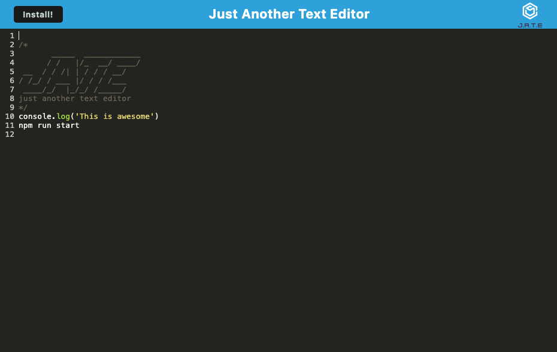

# A single page text editor application that runs in the browser and meets PWA criteria just for you 	  

## Table Of Contents
- [Description](#description)
- [Installation](#installation)
- [Usage](#usage)
- [Contributing](#contributing)
- [License](#license)
- [Tests](#tests)
- [Questions](#questions)

# Description
This is a text editor that runs in the browser. The app is a single-page application that meets the PWA criteria. Additionally, it features a number of data persistence techniques that serve as redundancy in case one of the options is not supported by the browser. The application also functions offline.

# Installation
Navigate your browser to     and start typing in the console! Download the app to use it offline as well!

# Usage
Perfect for practicing your console logging and terminal typing!

# Visuals/Links

https://github.com/SDKwapis/A-single-page-text-editor-application-that-runs-in-the-browser-and-meets-PWA-criteria-just-for-you

# Contributing
This project was built using class materials and rewatching the class recordings. Certain syntax and definitions were reference from the module 19 mini project.

# License
MIT

# Tests
All tests were run through console logs.

# Questions
[GitHub Profile](https://github.com/SDKwapis)
For questions or comments please reach out to me at: sdkwapis@gmail.com